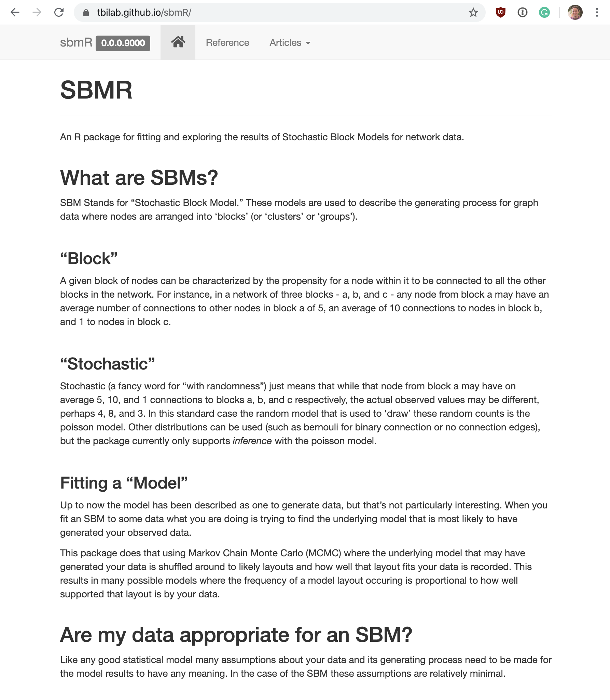

```{r setup, include = FALSE}
knitr::opts_chunk$set(
  fig.dim=c(5, 4), 
  fig.retina=2, 
  out.width="100%",
  message=FALSE,
  warning=FALSE,
  cache = TRUE
  )

library(knitr)
set.seed(42)
```
class: middle


---

# Layout


- What am I selling?
- The Why
- The Process
- The Product

---
# About Me

.pull-left[

## Career
- Previously:
  - Software Engineering w/ Javascript
  - Worked for NY Times Graphics Department
- Now:
  - PhD. Candidate, Vanderbilt Biostatistics
  - Focusing on Visualization and Unsupervized learning
- Future:
  - Looking for Data Science positions for post graduation
]

.pull-right[
## Links
- Blog at [LiveFreeOrDichotomize.com](https://livefreeordichotomize.com/)
- Tweet at [@nicholasStrayer](https://twitter.com/NicholasStrayer)
- Code at [github.com/nstrayer](https://github.com/nstrayer)

]


---
class: middle


## What am I selling?

.pull-left[
### A Thing 

.center[
.iconed[📦]
]

`sbmR`: an R package to perform uncertainty-aware unsupervised clustering of graph data. 
]
.pull-right[
### An Idea 

.center[
.iconed[💭]
]

Building an R package alongside a research project serves to strengthen both the package and the research. 
]

---


class:middle

# The Why


---

class: middle


# But first... Jargon Break!

---

# Bi or Poly-partite networks

> Networks that have nodes of multiple distinct types where connections can't form between nodes of the same type. 


---

# The __S__tochastic __B__lock __M__odel?

A network model to cluster nodes into "blocks". 


---


# An equation for validity

<div style="margin-top:-75px;">

</div>

---

# Really why I showed an equation


---
class: middle


# Why SBMs

.pull-left[
- Working with Electronic Health Records (EHR) data

- Questions arise like "who are these people similar to and why?"

- Tried Deep Learning
  - Lack of interpretability
  - Needed specialization for bipartite networks

- Needed method that acknowledges the limitations of the data. 
]
.pull-right[

]


---
class: middle

# Why write a package?

.pull-left[
Graph-Tool in Python fits SBMs but...
- Lab uses R
- We're focused on uncertainty
- Needed to tweak underlying methods for bipartite networks etc. 
- Wanted to present at RStudio::conf

]
.pull-right[
.center[.iconed[📦]]
]

	
	
---
class: middle

# The Process

---
class: middle

# Getting to the starting line

.pull-left[
  __Looking into possible graph libraries__

  - iGraph is a monolith
    - Adding computationally heavy steps in R brought it to a halt 
 
- [Jim Hester's it_depends talk](https://resources.rstudio.com/rstudio-conf-2019/it-depends-a-dialog-about-dependencies)
  
  
  
]
	
.pull-right[
  __Deciding to use Rcpp__

  - Low-level interface allowed stripping away of non-essentials for graph manipulation. 
  - Wanted an excuse to write in a typed and compiled language.
  

![:space 5]


]
	


---
class: middle

# Tests and simulated data catch errors


.pull-left[
__Software $\to$ Unit Tests__

- Toy examples to test basic functions 
- Builds strong foundations for larger models
- Solidifies intuition about behavior

![:space 5]


]

.pull-right[
__Statistics $\to$ Simulated Data__
- Stochastic data _will_ find your edge cases
- Gives an idea of real-world performance

![:space 7]


]


---
class: middle

# Getting speedy with it

.bullet_emoji[🗺] Following the equations in their exact form is inefficient.


<div class = "center", style = "margin-top:-5px; margin-bottom:-70px;">


</div>


.pull-left[
.bullet_emoji[🛠] Reworking for efficiency leads to better understanding
]
.pull-right[
.bullet_emoji[🧐] Question the purpose of every operation, they are expensive
]


---

# Documentation as tests

.pull-left[

![:spacePx 50]

__Constantly updating documentation...__

![:spacePx 40]


.bullet_emoji[📷] Keeps you focused on the big picture


![:spacePx 50]

.bullet_emoji[👃] Is an informal sniff-test for results
]

.pull-right[

]


---

# Vignette or perish

.pull-left[

![:spacePx 60]

__Learning resources__

.bullet_emoji[🥀] If no-one knows __how__ to use your package/method no-one __will__ use it. 
![:spacePx 80]

__Covertly writing__

.bullet_emoji[🖍] Once you're done, you have written a lot

]


<div class = "pull-right" style = "margin-top: -5em;">

</div>

---

class: middle

# The Product

---

# What exactly is `sbmR`?

.pull-left[

![:spacePx 90]

- Native R package (kinda)

- Fits SBMs

- Investigates uncertainty of found structure by sampling from bayesian posterior

- Provides (a growing list of) visualizations to communicate results

![:spacePx 30]


### [tbilab.github.io/sbmR/](https://tbilab.github.io/sbmR/)

]

.pull-right[
.shadowed[

]
]


---
class: middle

# What is needed to use it?

.pull-left[
### Data

.bullet_emoji[✔️] Data that can be represented as nodes and edges between those nodes
- Patients with diagnoses
- Genomes with mutations
- Social relationships
- ...

.bullet_emoji[🚫] Does not (yet) support non-discrete edges
- Correlations between variables
- Distances between cities
- ...
]


.pull-right[

### __Mentality__


.bullet_emoji[🍱] Interest in __how__ and __why__ your data cluster together

![:spacePx 90]

.bullet_emoji[⚖️] A desire to understand how stable clusters are

]


	

---
class: middle

# A quick demo 

---

## Simulate a network


.left-code[

Let's simulate a dense network with three blocks and 40 nodes per block.
```{r simulated-network, eval = FALSE, messages = FALSE}
library(magrittr)
library(tidyverse)
library(sbmR)

k <- 3    
n_k <- 40 

network <- sim_basic_block_network(
  n_blocks = k,     
  n_nodes_per_block = n_k
)

visualize_network(network)
```
]

.right-plot[
```{r simulated-network-out, ref.label="simulated-network", echo=FALSE}
```
]


---

## Find optimal MCMC initialization


.left-code[
Next we find the optimal (closest to median of posterior) starting point for our MCMC
```{r collapse-network, eval = FALSE, messages = FALSE}
# Setup SBM from data
my_sbm <- create_sbm(network)

# Run agglomerative collapsing
collapse_results <- my_sbm %>%
  collapse_blocks(sigma = 1.01)

# Visualize method used to 
# choose best state from
# results
collapse_results %>% 
  visualize_collapse_results(
    heuristic = 'delta_ratio'
  ) +
  xlim(0,15) +
  geom_vline(xintercept = k)
```
]

.right-plot[

```{r collapse-network-out, ref.label="collapse-network", echo=FALSE, warning = FALSE, fig.dim = c(5,4)}
```

]

```{r, echo=FALSE}
my_sbm <- choose_best_collapse_state(my_sbm, collapse_results, heuristic = 'delta_ratio')
```

---

## Sanity check...

We can join the model's state after our collapse with the true generating data's blocks to see how well the collapsing algorithm fit the data. 
.left-code[

```{r check-collapse, eval = FALSE}
# Model state after merge
merged_state <- my_sbm %>% 
  get_state() %>% 
  select(id, parent)

# Join with true block info
left_join(
  network$nodes,
  merged_state,
  by = "id"
) %>% 
  rename(inferred = parent) %$% 
  table(inferred, block) 
```
]

.right-plot[
```{r check-collapse-out, ref.label="check-collapse", echo=FALSE}
```
]

---

## Sampling from posterior


.left-code[

Run MCMC sweeps from collapse starting point to investigate the posterior structure.
```{r mcmc-sweeps, eval = FALSE}
sweep_results <- my_sbm %>% 
  mcmc_sweep(num_sweeps = 25, 
             eps = 0.25, 
             track_pairs = TRUE)

# Plot Sweep Results
sweep_results$sweep_info %>% 
  mutate(sweep = 1:n()) %>%
  pivot_longer(
    c(entropy_delta,
      num_nodes_moved)
  ) %>% 
  ggplot(aes(x = sweep, 
             y = value)) +
  geom_line() +
  facet_grid(name~., 
             scales = "free_y")
```
]

.right-plot[
```{r mcmc-sweeps-out, ref.label="mcmc-sweeps", echo = FALSE}
```

]

---

## Investigating Uncertainty in clustering

.left-code[

Plot the pairwise probability two nodes residing in the same block
```{r pairwise-propensity, eval = FALSE}

sweep_results$pairing_counts %>% 
  ggplot(aes(x = node_a, 
             y = node_b)) +
  geom_raster(
    aes(fill = proportion_connected)
  ) +
  theme(
    axis.text = element_blank(),
    axis.ticks = element_blank()
  )
```
]

.right-plot[
```{r pairwise-propensity-out, ref.label="pairwise-propensity", echo = FALSE, fig.dims=c(4,4)}
```

]


---

## Concensus-SNE

.left-code[

Package function to visualize the pairwise node to node block similarity with a network. 
```{r pairwise-propensity-network, eval = FALSE}
sweep_results %>% 
  visualize_propensity_network()
```
]

.right-plot[
```{r pairwise-propensity-network-out, ref.label="pairwise-propensity-network", echo = FALSE}
```

]


---
# Future plans

.pull-left[
## Node-level uncertainty 
Determine which values are structural outliers
]
	
.pull-right[
## Lots of visualizations
Visualization based inference for highly complex models
]

---

# The Appendix

## Thanks to
.pull-left[
- My advisor Yaomin Xu
- Lab Biostatistician Siwei Zheng
- Other lab members for thoughtful comments during entire process
- Vanderbilt Biostatistics Development Grant
- My Cat (and wife)
]

.pull-right[

]


